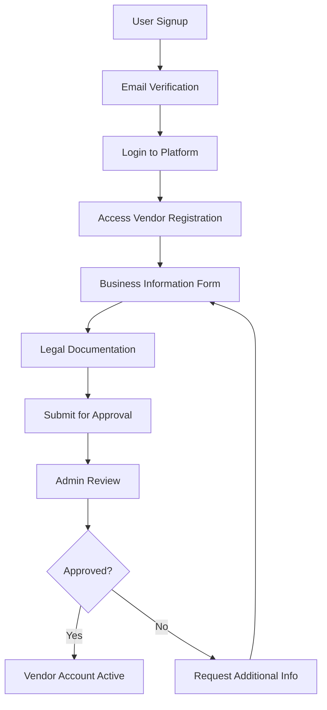
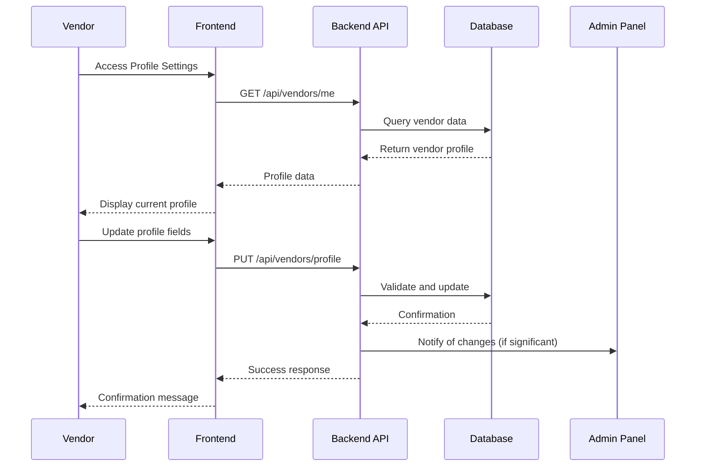
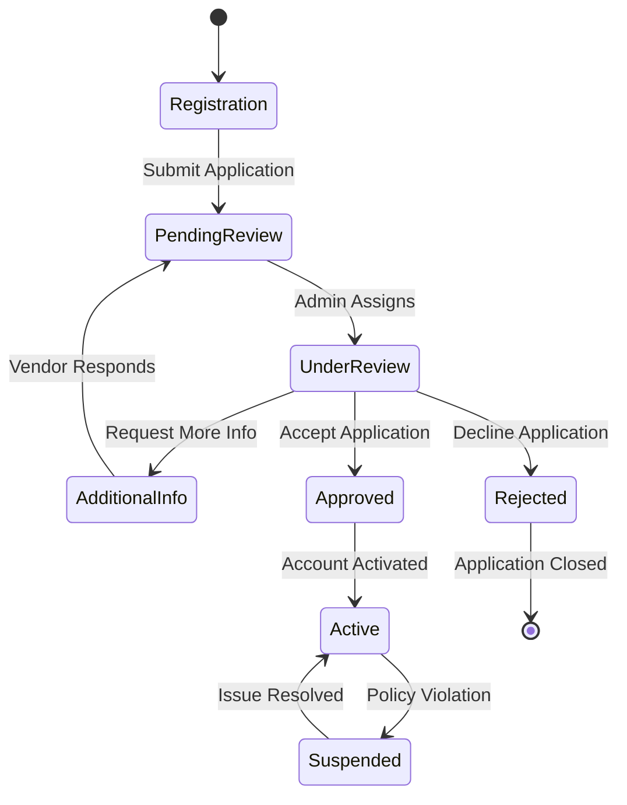
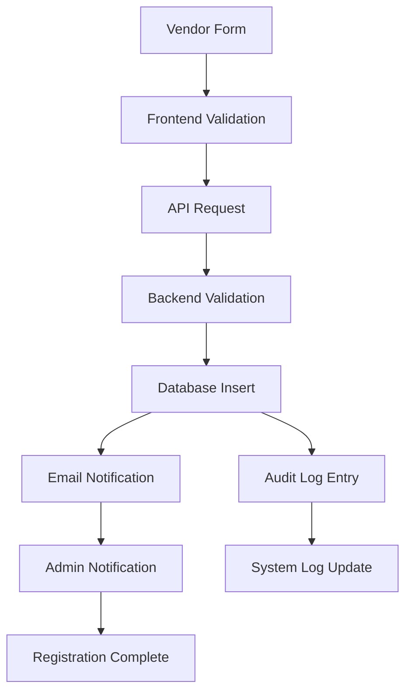
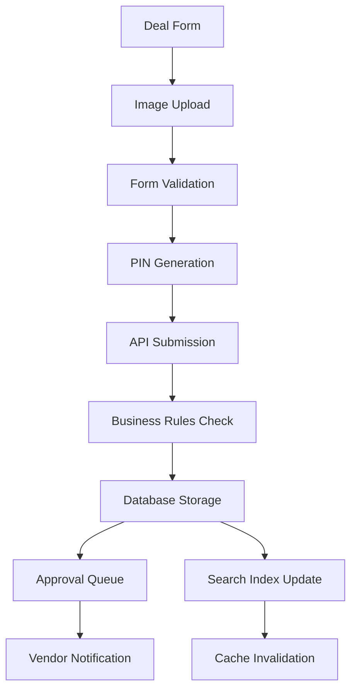
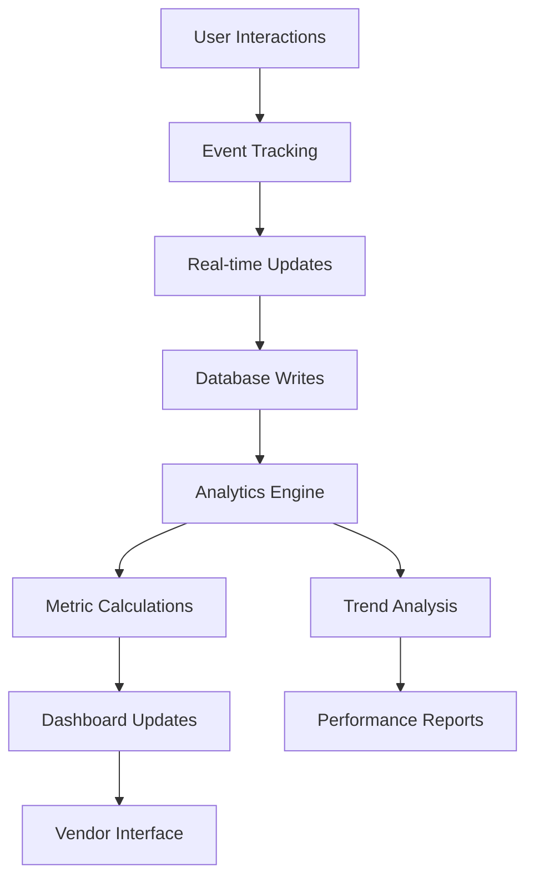

# Vendor Process & Data Flow Documentation
## Instoredealz Platform

**Last Updated:** July 13, 2025  
**Version:** 1.0

## Table of Contents
1. [Overview](#overview)
2. [Vendor Registration Process](#vendor-registration-process)
3. [Vendor Profile Management](#vendor-profile-management)
4. [Deal Creation & Management](#deal-creation--management)
5. [Vendor Dashboard & Analytics](#vendor-dashboard--analytics)
6. [Approval Workflow](#approval-workflow)
7. [Data Flow Architecture](#data-flow-architecture)
8. [Database Schema](#database-schema)
9. [API Endpoints](#api-endpoints)
10. [Security & Authentication](#security--authentication)
11. [Business Intelligence](#business-intelligence)

---

## Overview

The Instoredealz vendor system provides a comprehensive platform for businesses to register, manage profiles, create deals, and track performance through advanced analytics. The system supports multi-tier approval workflows, real-time analytics, and secure PIN-based deal verification.

### Key Features
- **Multi-step vendor registration** with business verification
- **Profile management** with business details and legal information
- **Deal creation wizard** with image upload and PIN generation
- **Real-time analytics dashboard** with colorful visualizations
- **Approval workflow** with admin oversight
- **PIN-based verification** for offline deal redemption
- **Performance tracking** with conversion metrics

---

## Vendor Registration Process

### 1. Initial Registration Flow



### 2. Registration Form Fields

#### Business Information
- **Business Name** (required)
- **Business Type** (sole proprietorship, partnership, corporation, etc.)
- **Industry Category** (dropdown selection)
- **Business Description** (detailed overview)
- **Website URL** (optional)
- **Years in Business**

#### Contact Information
- **Primary Contact Name**
- **Email Address** (must match login email)
- **Phone Number** (with verification)
- **Secondary Contact** (optional)

#### Address Details
- **Business Address** (street, city, state, postal code)
- **Billing Address** (if different)
- **Store Locations** (multiple addresses supported)

#### Legal Information
- **PAN Number** (mandatory for Indian businesses)
- **GST Registration Number** (if applicable)
- **Business License Number**
- **Tax ID/TIN Number**
- **Legal Entity Registration**

### 3. Data Validation Rules

```typescript
interface VendorRegistration {
  businessName: string; // 3-100 characters
  businessType: string; // predefined options
  category: string; // from categories table
  description: string; // 50-1000 characters
  website?: string; // valid URL format
  contactName: string; // 2-50 characters
  email: string; // valid email, matches user account
  phone: string; // 10-digit Indian number
  address: string; // complete address
  city: string; // from cities list
  state: string; // from states list
  pincode: string; // 6-digit postal code
  panNumber: string; // valid PAN format
  gstNumber?: string; // valid GST format
  businessLicense: string; // alphanumeric
}
```

---

## Vendor Profile Management

### 1. Profile Components

#### Business Overview
- **Company logo** (image upload with 5MB limit)
- **Business name** and tagline
- **Industry and category**
- **Business description** (rich text editor)
- **Operating hours** and days
- **Contact information**

#### Location Management
- **Primary business address**
- **Multiple store locations**
- **Service areas** (delivery/pickup zones)
- **Geographic coverage**

#### Legal & Compliance
- **Tax identification numbers**
- **Business licenses**
- **Insurance information**
- **Regulatory compliance status**

### 2. Profile Update Process



---

## Deal Creation & Management

### 1. Deal Creation Workflow

#### Step 1: Basic Information
- **Deal title** (compelling, descriptive)
- **Deal description** (detailed terms and conditions)
- **Category selection** (primary and secondary)
- **Deal type** (discount, BOGO, fixed price, etc.)

#### Step 2: Pricing & Discounts
- **Original price** (if applicable)
- **Discount percentage** (primary pricing model)
- **Final price calculation**
- **Minimum order value** (optional)
- **Maximum discount cap** (optional)

#### Step 3: Deal Parameters
- **Validity period** (start and end dates)
- **Usage limits** (total redemptions allowed)
- **User restrictions** (membership tiers: basic, premium, ultimate)
- **Geographic limitations** (specific cities/areas)

#### Step 4: Visual Content
- **Deal images** (multiple uploads supported)
- **Image formats** (JPG, PNG, GIF)
- **File size limits** (5MB per image)
- **Image optimization** (automatic compression)

#### Step 5: Verification Setup
- **4-digit PIN generation** (automatic or manual)
- **PIN security** (encrypted storage)
- **Offline verification** capability
- **PIN rotation** (optional, 30-minute intervals)

### 2. Deal Management Features

#### Deal Status Tracking
```typescript
enum DealStatus {
  DRAFT = 'draft',           // Created but not submitted
  PENDING = 'pending',       // Submitted for approval
  APPROVED = 'approved',     // Admin approved
  ACTIVE = 'active',         // Live and available
  PAUSED = 'paused',         // Temporarily disabled
  EXPIRED = 'expired',       // Past validity date
  REJECTED = 'rejected'      // Admin rejected
}
```

#### Performance Metrics
- **View count** (unique and total views)
- **Claim count** (total deal claims)
- **Redemption count** (PIN-verified completions)
- **Conversion rate** (claims to redemptions)
- **Revenue generated** (estimated based on redemptions)

---

## Vendor Dashboard & Analytics

### 1. Dashboard Components

#### Statistics Overview
- **Active deals count** with blue gradient theme
- **Total redemptions** with green gradient theme
- **Total views** with purple gradient theme
- **Average rating** with amber gradient theme

#### Chart Visualizations

##### Deal Performance Chart (Bar Chart)
```typescript
interface DealPerformanceData {
  name: string;           // Deal title (truncated)
  views: number;          // Total views
  redemptions: number;    // Total redemptions
  conversionRate: number; // Percentage conversion
}
```
- **Blue gradient bars** for views
- **Green gradient bars** for redemptions
- **Interactive tooltips** with detailed metrics

##### Monthly Trends (Area Chart)
```typescript
interface MonthlyTrendsData {
  month: string;      // Month name
  redemptions: number; // Monthly redemptions
  revenue: number;     // Monthly revenue estimate
  growth: number;      // Growth percentage
}
```
- **Green area fill** for redemptions trend
- **Purple area fill** for revenue trend
- **Gradient opacity effects** for visual appeal

##### Deal Status Distribution (Pie Chart)
```typescript
interface StatusDistribution {
  name: string;   // Status name
  value: number;  // Count of deals
  color: string;  // Hex color code
}
```
- **Green (#10B981)** for active deals
- **Amber (#F59E0B)** for pending deals
- **Red (#EF4444)** for inactive deals

#### Key Performance Indicators
- **Average views per deal**
- **Conversion rate percentage**
- **Revenue per deal**
- **Performance score** (composite metric)

### 2. Analytics Data Sources

#### Real-time Metrics
- Live deal view tracking
- Instant redemption updates
- User engagement metrics
- Geographic performance data

#### Historical Analysis
- Monthly trend analysis
- Seasonal performance patterns
- Category-wise performance
- Competitive benchmarking

---

## Approval Workflow

### 1. Vendor Approval Process



#### Approval Criteria
- **Business legitimacy** verification
- **Document authenticity** check
- **Category appropriateness** assessment
- **Platform policy compliance**
- **Financial stability** indicators

### 2. Deal Approval Process

#### Automatic Approval Triggers
- Vendor has approved status
- Deal content passes automated checks
- No policy violations detected
- Standard categories and pricing

#### Manual Review Requirements
- New vendor's first deals
- High-value offers (>50% discount)
- Sensitive categories
- Custom categories
- Unusual terms and conditions

---

## Data Flow Architecture

### 1. Vendor Registration Data Flow



### 2. Deal Creation Data Flow



### 3. Analytics Data Flow



---

## Database Schema

### 1. Core Vendor Tables

#### vendors
```sql
CREATE TABLE vendors (
  id SERIAL PRIMARY KEY,
  user_id INTEGER REFERENCES users(id),
  business_name VARCHAR(255) NOT NULL,
  business_type VARCHAR(100),
  category VARCHAR(100),
  description TEXT,
  website VARCHAR(255),
  contact_name VARCHAR(255),
  phone VARCHAR(20),
  address TEXT,
  city VARCHAR(100),
  state VARCHAR(100),
  pincode VARCHAR(10),
  pan_number VARCHAR(20),
  gst_number VARCHAR(20),
  business_license VARCHAR(255),
  logo_url VARCHAR(500),
  is_approved BOOLEAN DEFAULT false,
  approval_date TIMESTAMP,
  approved_by INTEGER REFERENCES users(id),
  rating DECIMAL(3,2) DEFAULT 0,
  total_ratings INTEGER DEFAULT 0,
  created_at TIMESTAMP DEFAULT CURRENT_TIMESTAMP,
  updated_at TIMESTAMP DEFAULT CURRENT_TIMESTAMP
);
```

#### deals
```sql
CREATE TABLE deals (
  id SERIAL PRIMARY KEY,
  vendor_id INTEGER REFERENCES vendors(id),
  title VARCHAR(255) NOT NULL,
  description TEXT,
  category VARCHAR(100),
  subcategory VARCHAR(100),
  discount_percentage INTEGER,
  original_price DECIMAL(10,2),
  final_price DECIMAL(10,2),
  max_redemptions INTEGER,
  current_redemptions INTEGER DEFAULT 0,
  membership_required VARCHAR(20) DEFAULT 'basic',
  valid_from TIMESTAMP,
  valid_until TIMESTAMP,
  verification_pin VARCHAR(10),
  pin_salt VARCHAR(255),
  pin_created_at TIMESTAMP,
  pin_expires_at TIMESTAMP,
  is_active BOOLEAN DEFAULT true,
  is_approved BOOLEAN DEFAULT false,
  approval_date TIMESTAMP,
  approved_by INTEGER REFERENCES users(id),
  view_count INTEGER DEFAULT 0,
  image_url VARCHAR(500),
  terms_conditions TEXT,
  created_at TIMESTAMP DEFAULT CURRENT_TIMESTAMP,
  updated_at TIMESTAMP DEFAULT CURRENT_TIMESTAMP
);
```

### 2. Analytics Tables

#### deal_views
```sql
CREATE TABLE deal_views (
  id SERIAL PRIMARY KEY,
  deal_id INTEGER REFERENCES deals(id),
  user_id INTEGER REFERENCES users(id),
  ip_address INET,
  user_agent TEXT,
  viewed_at TIMESTAMP DEFAULT CURRENT_TIMESTAMP,
  session_id VARCHAR(255)
);
```

#### deal_claims
```sql
CREATE TABLE deal_claims (
  id SERIAL PRIMARY KEY,
  deal_id INTEGER REFERENCES deals(id),
  user_id INTEGER REFERENCES users(id),
  status VARCHAR(20) DEFAULT 'pending',
  claimed_at TIMESTAMP DEFAULT CURRENT_TIMESTAMP,
  verified_at TIMESTAMP,
  verification_pin VARCHAR(10),
  bill_amount DECIMAL(10,2),
  actual_savings DECIMAL(10,2),
  vendor_id INTEGER REFERENCES vendors(id)
);
```

#### pin_attempts
```sql
CREATE TABLE pin_attempts (
  id SERIAL PRIMARY KEY,
  deal_id INTEGER REFERENCES deals(id),
  user_id INTEGER REFERENCES users(id),
  attempted_pin VARCHAR(10),
  success BOOLEAN,
  attempted_at TIMESTAMP DEFAULT CURRENT_TIMESTAMP,
  ip_address INET,
  user_agent TEXT
);
```

---

## API Endpoints

### 1. Vendor Management Endpoints

#### Registration
```http
POST /api/vendors/register
Content-Type: application/json

{
  "businessName": "string",
  "businessType": "string",
  "category": "string",
  "description": "string",
  "website": "string",
  "contactName": "string",
  "phone": "string",
  "address": "string",
  "city": "string",
  "state": "string",
  "pincode": "string",
  "panNumber": "string",
  "gstNumber": "string",
  "businessLicense": "string"
}
```

#### Profile Management
```http
GET /api/vendors/me
Authorization: Bearer <jwt_token>

PUT /api/vendors/profile
Authorization: Bearer <jwt_token>
Content-Type: application/json

{
  "businessName": "string",
  "description": "string",
  "website": "string",
  "phone": "string",
  "address": "string"
}
```

### 2. Deal Management Endpoints

#### Deal Creation
```http
POST /api/vendors/deals
Authorization: Bearer <jwt_token>
Content-Type: application/json

{
  "title": "string",
  "description": "string",
  "category": "string",
  "discountPercentage": "number",
  "maxRedemptions": "number",
  "membershipRequired": "string",
  "validFrom": "string",
  "validUntil": "string",
  "imageUrl": "string",
  "termsConditions": "string"
}
```

#### Deal Analytics
```http
GET /api/vendors/deals/{id}/analytics
Authorization: Bearer <jwt_token>

Response:
{
  "dealId": "number",
  "title": "string",
  "viewCount": "number",
  "claimCount": "number",
  "redemptionCount": "number",
  "conversionRate": "number",
  "revenueGenerated": "number",
  "demographics": {
    "ageGroups": [],
    "locations": [],
    "membershipTiers": []
  }
}
```

### 3. PIN Verification Endpoints

#### Generate PIN
```http
POST /api/vendors/generate-pin
Authorization: Bearer <jwt_token>

Response:
{
  "pin": "string",
  "hashedPin": "string",
  "salt": "string",
  "expiresAt": "string"
}
```

#### Current PIN
```http
GET /api/vendors/deals/{id}/current-pin
Authorization: Bearer <jwt_token>

Response:
{
  "currentPin": "string",
  "nextRotationAt": "string",
  "rotationInterval": "number",
  "isActive": "boolean"
}
```

---

## Security & Authentication

### 1. Authentication Flow

#### JWT Token Structure
```typescript
interface VendorJWT {
  sub: string;          // User ID
  email: string;        // Vendor email
  role: string;         // 'vendor'
  vendorId: string;     // Vendor ID
  isApproved: boolean;  // Approval status
  iat: number;          // Issued at
  exp: number;          // Expires at
}
```

#### Authorization Middleware
```typescript
function requireVendorAuth(req: Request, res: Response, next: NextFunction) {
  const token = req.headers.authorization?.split(' ')[1];
  
  if (!token) {
    return res.status(401).json({ error: 'Authentication required' });
  }
  
  try {
    const decoded = jwt.verify(token, process.env.JWT_SECRET) as VendorJWT;
    
    if (decoded.role !== 'vendor') {
      return res.status(403).json({ error: 'Vendor access required' });
    }
    
    req.vendor = decoded;
    next();
  } catch (error) {
    return res.status(401).json({ error: 'Invalid token' });
  }
}
```

### 2. PIN Security

#### PIN Generation
```typescript
function generateSecurePin(): string {
  const crypto = require('crypto');
  
  // Generate cryptographically secure random PIN
  let pin: string;
  do {
    const buffer = crypto.randomBytes(2);
    const number = buffer.readUInt16BE(0);
    pin = (number % 9000 + 1000).toString();
  } while (pin.length !== 4);
  
  return pin;
}
```

#### PIN Hashing
```typescript
async function hashPin(pin: string): Promise<{hashedPin: string, salt: string}> {
  const bcrypt = require('bcrypt');
  const crypto = require('crypto');
  
  // Generate unique salt
  const salt = crypto.randomBytes(16).toString('hex');
  
  // Hash PIN with salt using bcrypt (12 rounds)
  const hashedPin = await bcrypt.hash(pin + salt, 12);
  
  return { hashedPin, salt };
}
```

### 3. Rate Limiting

#### PIN Attempt Limits
```typescript
interface RateLimitConfig {
  maxAttemptsPerHour: 5;
  maxAttemptsPerDay: 10;
  lockoutDuration: 3600; // 1 hour in seconds
  failureWindow: 86400;  // 24 hours in seconds
}
```

---

## Business Intelligence

### 1. Vendor Performance Metrics

#### Key Performance Indicators (KPIs)
- **Deal Success Rate**: Approved deals / Total submitted deals
- **Customer Engagement**: Average views per deal
- **Conversion Rate**: Redemptions / Total claims
- **Revenue per Deal**: Estimated revenue / Number of deals
- **Customer Satisfaction**: Average rating from customers

#### Performance Scoring Algorithm
```typescript
function calculatePerformanceScore(vendor: VendorData): number {
  const weights = {
    dealSuccessRate: 0.25,
    customerEngagement: 0.20,
    conversionRate: 0.25,
    revenuePerDeal: 0.15,
    customerSatisfaction: 0.15
  };
  
  const normalizedScores = {
    dealSuccessRate: vendor.approvedDeals / vendor.totalDeals,
    customerEngagement: Math.min(vendor.avgViewsPerDeal / 100, 1),
    conversionRate: vendor.redemptions / vendor.totalClaims,
    revenuePerDeal: Math.min(vendor.avgRevenuePerDeal / 1000, 1),
    customerSatisfaction: vendor.rating / 5
  };
  
  let score = 0;
  for (const [metric, weight] of Object.entries(weights)) {
    score += normalizedScores[metric] * weight;
  }
  
  return Math.round(score * 100);
}
```

### 2. Analytics Dashboard Data

#### Real-time Metrics
```typescript
interface DashboardMetrics {
  totalActiveDeals: number;
  totalRedemptions: number;
  totalViews: number;
  averageRating: number;
  performanceScore: number;
  
  monthlyTrends: {
    month: string;
    redemptions: number;
    revenue: number;
    growth: number;
  }[];
  
  dealPerformance: {
    dealId: number;
    title: string;
    views: number;
    redemptions: number;
    conversionRate: number;
  }[];
  
  statusDistribution: {
    active: number;
    pending: number;
    inactive: number;
  };
}
```

### 3. Reporting Features

#### Automated Reports
- **Daily Performance Summary** (email/dashboard)
- **Weekly Trend Analysis** (detailed insights)
- **Monthly Business Review** (comprehensive report)
- **Quarterly Growth Analysis** (strategic planning)

#### Custom Report Builder
- Date range selection
- Metric customization
- Export formats (PDF, Excel, CSV)
- Scheduled delivery options

---

## Integration Points

### 1. External Service Integrations

#### Email Service (SendGrid)
```typescript
interface EmailNotification {
  type: 'welcome' | 'approval' | 'rejection' | 'performance';
  recipient: string;
  data: any;
  template: string;
}
```

#### Payment Gateway (Razorpay)
```typescript
interface PaymentIntegration {
  vendorId: string;
  bankAccount: string;
  settlementSchedule: 'daily' | 'weekly';
  commissionRate: number;
}
```

### 2. Third-party Analytics

#### Google Analytics Integration
- Event tracking for deal interactions
- Conversion goal setup
- Custom dimensions for vendor segmentation
- E-commerce tracking for revenue attribution

#### Business Intelligence Tools
- Power BI dashboard connectivity
- Tableau integration for advanced analytics
- Custom API endpoints for data export

---

## Maintenance & Monitoring

### 1. System Health Monitoring

#### Performance Metrics
- API response times
- Database query performance
- Image upload success rates
- Email delivery rates

#### Error Tracking
- Application error logging
- User interaction failures
- Payment processing issues
- Integration failures

### 2. Data Backup & Recovery

#### Backup Strategy
- Daily automated database backups
- Image asset backup to cloud storage
- Configuration backup
- Transaction log backup

#### Recovery Procedures
- Point-in-time recovery capability
- Disaster recovery testing
- Data integrity verification
- Business continuity planning

---

## Conclusion

This comprehensive vendor process and data flow documentation provides a complete overview of the Instoredealz vendor management system. The platform offers robust functionality for vendor registration, profile management, deal creation, and performance analytics, all supported by secure authentication, comprehensive data flow, and business intelligence capabilities.

The system is designed to scale with business growth while maintaining data integrity, security, and user experience standards. Regular updates to this documentation will ensure it remains current with platform evolution and new feature additions.

---

**Document Status:** Complete  
**Next Review Date:** October 13, 2025  
**Maintained By:** Instoredealz Development Team